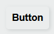
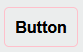
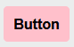
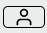
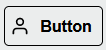
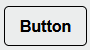
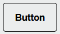
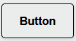
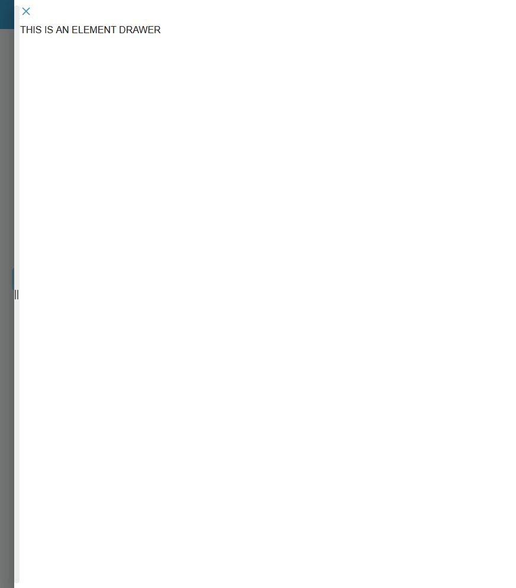

[`◀️Homepage`](../../../README.md)

# **Button** 

**import**
>           import M_Button from 'src/components/M_Components/M_Button/M_Button'
  

## **Basic**

To create a basic button like this, you only need to use the 'label' and 'onClick' properties.

    

>            <M_Button label={'Button'} onClick={() => do something()} />

## **Colors**

You can customize your buttonby changing the color of your border, background and label color using borderColor, backgroundColor, labelColor and defining what color you want:

>            <M_Button borderColor={'pink'} label={'Button'} onClick={() => do something()} />
> 
>            <M_Button backgroundColor={'pink'} label={'Button'} onClick={() => do something()} />

## **Icons**

Adding icons to your button is strictly done with html elements to increase customizability. You can add them with the icon property and set its location with iconPosition (right or left)

    

 >          <M_Button icon={} borderColor={'black'} onClick={() => do something()} />
 >
 >          <M_Button iconPosition={'left'} icon={} borderColor={'black'} label={'Button'} onClick={() => do something()} />

## **Size**

Changing size is done by simply adding the word *small*, *normal* or *large* to the M_Component

 

>           <M_Button small borderColor={'black'} label={'Button'} onClick={() => do something()} />
>
>           <M_Button normal borderColor={'black'} label={'Button'} onClick={() => do something()} />
>
>           <M_Button large borderColor={'black'} label={'Button'} onClick={() => do something()} />

# **Drawer**

You can use any combination of settings to open a drawer as long as you defined the properties *element* if you want a personalized drawer ( you pass the html elements), *entity* if you weeant a table drawer ( here you defined what table to use), *tableLabel* when using a tableDrawer to define the drawer name, *getLine*, function that returns the line you select on the table, *FILTER* filter string used to filter the table 

>                       <M_Button element={ THIS IS AN ELEMENT DRAWER} label={'teste'} icon={} backgroundColor={'var(--color-blue-light)'} labelColor={'white'}  />

## **Other features**

| Properties           	| Description                                          	| Example                                        	|
|----------------------	|------------------------------------------------------	|------------------------------------------------	|
| onClick              	| Passed function is executed on click                 	| onClick={()=>function()}                       	|
| borderColor          	| color the border                                     	| borderColor={'black'}                          	|
| backgroundColor      	| color the background                                 	| backgroundColor={'black'}                      	|
| label                	| Button Label                                         	| label={'Button'}                               	|
| labelColor           	| color the button label                               	| labelColor={'white'}                           	|
| icon                 	| icon element                                         	| icon={} 	|
| iconPosition         	| position of the icon ( left or right)                	| iconPosition={'right'}                         	|
| tooltip              	| tooltip string                                       	| tooltip={'Button'}                             	|
| small, normal, large 	| used to set button size                              	| small, normal, large                           	|
| element              	| html elements to pass inside a drawer                	| element={example}                 	|
| entity               	| entity name to use for the table drawer              	| entity={'account}                              	|
| tableLabel           	| label used inside the table drawer                   	| tableLabel={'LABEL'}                           	|
| getLine              	| function that returns the line selected on the table 	| getLine={() => {}}                             	|
| FILTER               	| string used to filter the table in the drawer        	| '(Field Name) (eq /contains) (value)'          	|
| disable              	|                                                      	| true or false.                                 	|