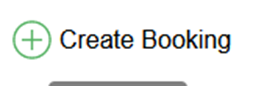

[`◀️Homepage`](../../../README.md)

# **Button Drawer** 

**Import**
- *`import M_ButtonDrawer from 'src/components/M_Components/M_ButtonDrawer/M_ButtonDrawer'`*

**Basic**

>       <M_ButtonDrawer
>           entity={'booking'}
>           label={''}
>           source={'/icons/tableIcons/search.svg'}
>           isSimple={true} 
>           width={isLabel}
>           onGetline={saveline}
>           tableLabel={'Bookings'}
>         />

**Other features**

| Properties  	| Description                                                                   	| Example                               	|
|-------------	|-------------------------------------------------------------------------------	|---------------------------------------	|
| entity      	| entity used on the table                                                      	|                                       	|
| label       	| label for the button                                                          	|                                       	|
| source      	| icon or img used in the button                                                	|                                       	|
| passColor   	| define the color of the button                                                	|                                       	|
| isSimple    	| true or false. used to define if you want a header button or a global button  	|                                       	|
| width       	| true or false. used to hide the label when the width gets too small.          	|                                       	|
| onGetline   	| returns a line thats been selected. Object                                    	|                                       	|
| passIsTable 	| true or false. Determines if its a table Drawer or an element drawer.         	|                                       	|
| element     	| HTML element. Used when passIsTable is false.                                 	|                                       	|
| tableLabel  	| when passIsTable is true, shows when the drawer is opened                     	|                                       	|
| disable     	| true or false.                                                                	|                                       	|
| FILTER      	| string used to pre filter the table results                                   	| '(Field Name) (eq /contains) (value)' 	|