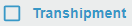

[`◀️Homepage`](../../../README.md)

# **CheckBox** 

**import**
- *`import M_CheckBox from 'src/components/M_Components/M_CheckBox/M_CheckBox'`*

**Basic**

To create a checkbox like this, you only need to use the label propriety.

>            <M_CheckBox label={"Transhipment"} />

**Other features**

| Properties  	| Description                                         	| Example                             	|
|-------------	|-----------------------------------------------------	|-------------------------------------	|
| label       	| Label sat on the checkbox                           	| string                              	|
| checked     	| If true, the component is checked                   	| checked={false}                     	|
| labelColor  	| The color of the label                              	| color={'var(--color-black)'}        	|
| color       	| The color of the component                          	| color={'var(--color-blue)'}         	|
| fontsize    	| The size of the component                           	| auto, medium or small               	|
| required    	| If true, the input element is required              	| required={true}                     	|
| icon        	| The icon to display when the component is unchecked 	| icon={}                             	|
| checkedIcon 	| The icon to display when the component is checked   	| checkedIcon={}                      	|
| onChange    	| Callback fired when the state is changed.           	| onChange={(e) =&gt; e.target.value} 	|
| disabled    	| If true, the component is disabled                  	| disabled={false}                    	|
| tooltipName 	| Label to show tooltip                               	| tooltipName={"tooltip"}             	|
| noPadding   	| removes padding                                     	|                                     	|
