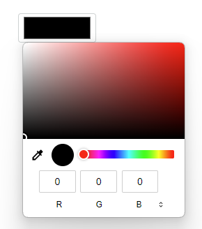

[`◀️Homepage`](../../../README.md)

# **Color Picker**

**import Color Picker**
> import { M_ColorPicker } from 'src/M_Components'

## **Basic**
To implement the Color Picker in the project, it is necessary to define a 'color', which defines the color of the color picker's border, a 'size' which defines the width of the input, and an 'onChange', where the function to store the color code will be inserted

    

**Slider**
>       <M_ColorPicker
>           color={"var(--color-red)"}
>           size={"100px"}
>           onChange={() => { }}
>       />

## **Other Features**

| Properties | Description                                         | Example                    |
| ---------- | --------------------------------------------------- | -------------------------- |
| color      | Border Color Picker color definition                | color={"var(--color-red)"} |
| size       | Setting the width of the Color Picker               | size={"100px"}             |
| onChange   | Desired function in onChange when selecting a color | onChange={() => { }}       |