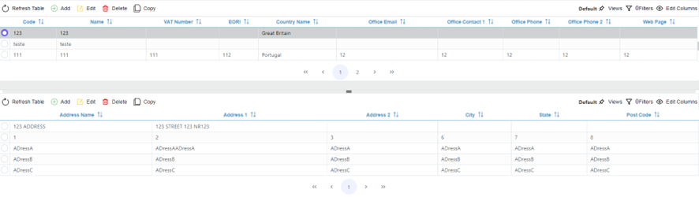

[`◀️Homepage`](../../../README.md)

# **Double Table** 

**import**

- *`import M_DoubleTable from 'src/components/M_Components/M_DoubleTable/M_DoubleTable'`*

**Basic**

                    <M_DoubleTable
                        parentEntity={'accountOffice'}
                        childEntity={'account'}
                        viewName={'accountOffice'}
                        field={'AccountId'}
                        rolePermissions={roles}
                        removeContextItems={removeContextItems}
                    />

**Other features**

| Properties         	| Description                                                                 	| Example                            	|
|--------------------	|-----------------------------------------------------------------------------	|------------------------------------	|
| parentEntity       	| defines the entity used on the parent Table                                 	| 'account',...                      	|
| childEntity        	| defines the entity used on the child table                                  	| 'accountOffice',...                	|
| field              	| Has the name of the field the child table is suppose to use when filtering. 	|                                    	|
| rolePermissions    	| array of strings with entity-operations                                     	| 'blCreate','blEdit','blDelete',... 	|
| removeContextItems 	| Used to remove the default context Menu options. Array of strings           	| ['Create', 'Delete',...]           	|
