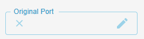
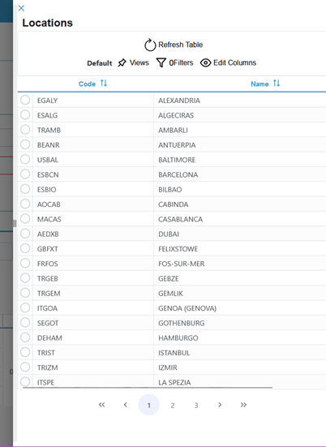

[`◀️Homepage`](../../../README.md)

# **Drawer Table TextField** 

**import**
- *`import M_DrawerTableTextField from 'src/components/M_Components/M_DrawerTableTextField/M_DrawerTableTextField'`*

**Basic**

>                     <M_DrawerTableTextField
>                       tableLabel={'Bookings'}
>                       label={'Booking Number'}
>                       entity={'booking'}
>                       filterField={'BookingNumber'}
>                       labelFields={['BookingNumber', 'ClientReference']}
>                       value={value}
>                       onSubmitValue={submitValue}
>                       size={'100%'}
>                   />
>
> 

**Other features**

| Properties    	| Description                                               	| Example                                                   	|
|---------------	|-----------------------------------------------------------	|-----------------------------------------------------------	|
| label         	| Label sat on top of the textfield                         	| string                                                    	|
| color         	| Colour                                                 	    |                                                           	|
| secondColor   	| Colour                                                 	    |                                                           	|
| value         	| value (object) that shows on the textfield                    | value={Object}                                             	|
| entity        	| table used on the drawer                                  	| entity={'location'}                                       	|
| required      	| true or false                                             	| required={true}                                           	|
| onValueChange 	| used to fill the field by typing.(not recommended!)       	| onValueChange={(e) => { }}                                	|
| filterField   	| field used to filter the table when writing on the textfield  |  filterField={'BookingNumber'}                             	|
| labelFields   	| array of fields used to show results when writing.         	|   labelFields={['BookingNumber', 'ClientReference']}          |
| onSubmitValue 	| returns an object with all the values of the line selected    | onSubmitValue={(value) => submitValue(value)}                 |
| tableLabel    	| Label that appears on the drawer                          	| string                                                    	|
| FILTER        	| string used to pre filter the table results               	| '(Field Name) (eq /contains) (value)'                     	|
| size            	|defines the width of the element                              	| size={'100px'}                                            	|
| icon           	|icon to open the table. Use mui icons for best use             | icon={<Clear />}                                            	|
