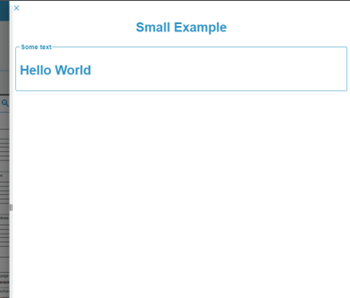

[`◀️Homepage`](../../../README.md)

# **Element Drawer** 

**import**
- *`import M_ElementDrawer from 'src/components/M_Components/M_ElementDrawer/M_ElementDrawer'`*

**Basic**

To create a drawer like this, you need to use the open, onClose and element properties (this element is basically a function that returns an HTML).

>            <M_ElementDrawer **open={openElement}** onClose={closeElement} element={element()} />

**Other features**

| Properties    	| Description                                               	| Example                                                   	|
|---------------	|-----------------------------------------------------------	|-----------------------------------------------------------	|
| toolTipClose      | Label to show close tooltip                                   | toolTipClose={"tooltip"}                                     |

Example element code:

>                   const element = () => {
>                        return (
>                            <>
>                                

>                                    <h1>Small Example </h1>
>                                

>                                <fieldset>
>                                    <legend>Some text</legend>
>                                    <h1>Hello World</h1>
>                                </fieldset>
>                            </>
>                        )
>                    }