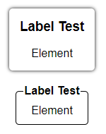

[`◀️Homepage`](../../../README.md)

# **FieldSet** 

**import**
- *`import M_FieldSet from 'src/M_Components/M_FieldSet/M_FieldSet'`*

**Basic**

To create one of the basic FieldSet's like these, you just need to use the label, labelInside and elements properties.

>     <M_Fieldset
>        label={"Label Test"}
>        borderRadius={"5px"}
>        labelInside
>        elements={
>            

>                Element
>            

>        }
>     />
>     <M_Fieldset
>        label={"Label Test"}
>        borderRadius={"5px"}
>        elements={
>            

>                Element
>            

>         }
>      />

**Other features**

| Properties 	| Description                          	| Example                  	|
|-------------- |--------------------------------------	|--------------------------	|
| label    	    | Header label	                                                     | label={"Label Test"}	    |
| labelColor    | Header color                                                       | labelColor={'var(--color-blue)'}             |
| elements  	| Body contente                                                      | html code        |
| fieldColor    | Container color                                                    | fieldColor={'var(--color-blue)'}     |
| borderRadius  | Border Radius of the container                                     | borderRadius={"5px"}     |
| labelInside   | prop to place the header inside or outside the container           | labelInside                                  |