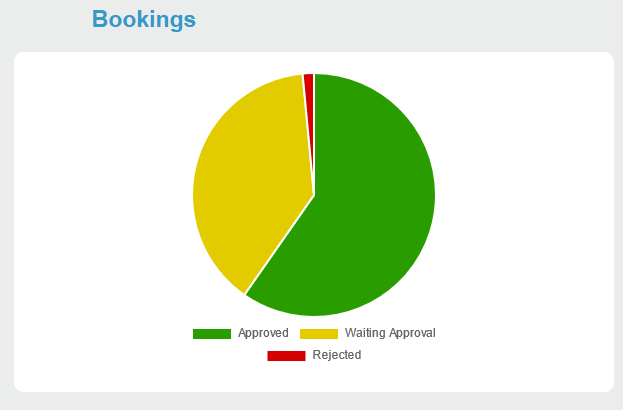
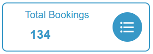
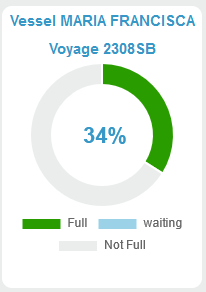
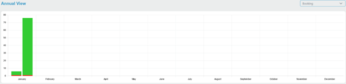

[`◀️Homepage`](../../../README.md)

# **Graphs** 

**Import**
- *`import M_Graph from 'src/components/M_Components/M_Graph/M_Graph'`*

**Basic**

     
     
    
     
    <!-- insert print od line Chart -->

>            <M_Graph type={type} label="Booking" values={values} />

**Values**

   * <b> Pie: </b>  Object composed by 'labels' and a 'datasets'. 'labels' is an Array of strings that defines the label for each slice and datasets is an Array of objects composed by 'data'(array of numbers) and 'backgroundColor' ( array of strings of colors) both of these arrays defines the values and color for each slice by order.

        <b> Example : </b>         
  >     {
  >      labels: ['Full', 'waiting', 'Not Full'],
  >      datasets: [
  >          {
  >              data: [200, 35, 200],
  >              backgroundColor: ["#299C00", "#E2CC00", "#D40000"],
  >          }
  >      ]
  >      }

    
*  <b> Data: </b>  Array Of Objects. Objects composed by 'Name' (string), 'value' (string), 'icon' (html) and 'color' (string)

    <b> Example : </b> 
>        [
>            { 
>                name: "primeira", 
>                value: 1,
>                icon: <FormatListBulletedIcon className='iconCardDashboard' color: 'var(--color-blue)'
>        },...]

*  <b> Doughnut: </b>  Object composed by 'labels' and a 'datasets'. 'labels' is an Array of strings that defines the label for each slice and datasets is an Array of objects composed by 'data'(array of numbers) and 'backgroundColor' ( array of strings of colors) both of these arrays defines the values and color for each slice by order.

    <b> Example : </b>  
 >        {
 >            labels: ['Full', 'waiting', 'Not Full'],
 >            datasets: [
 >                {
 >                    data: [200, 35, 200],
 >                    backgroundColor: ["#299C00", "#E2CC00", "#D40000"],
 >                }
 >            ]
 >        }
    
*  <b> Bar: </b>  Object composed by 'labels' and a 'datasets'. 'labels' is an Array of strings that defines the label for each section of the chart and datasets is an Array of objects composed by 'data'(array of numbers), 'backgroundColor' ( string of a color), 'label' (string) and a 'stack' (string). The data array defines the value for the bar and its position in the chart is defined by its position in the array.The label defines the name that shows up when you hobe the bar. Bars with the same stack, stacks if put in same section of the chart.

    <b> Example : </b>  
 >         {
 >             labels: ['Jan', 'Feb', 'Mar'],
 >             datasets: [
 >                 {
 >                     label: "Reject",
 >                     backgroundColor: '#ff0000',
 >                     data: [30, ,35],
 >                     stack: "Voyage1",
 >                 },
 >                  {
 >                     label: "Reject",
 >                     backgroundColor: '#ff0000',
 >                     data: [2,12,5],
 >                     stack: "Voyage2",
 >                 },
 >             ]
 >         }

 *  <b> Line: </b>  Object made up of 'labels' and 'datasets'. 'labels' is an array of strings that defines the label for each section of the chart and datasets is an array of objects made up of 'label' (string), 'data' (array of numbers), 'fill' (true or false), 'BorderColor' (string of one color) and 'backgroundColor' (string of one color). The data matrix defines the value for each point on the line and its position on the graph is defined by its position in the matrix. The label defines the name that appears when you hover over the line point.

     <b> Example : </b>  
 >         {
 >             labels: ['January', 'February', 'March', 'April', 'May', 'June', 'July']
 >             datasets: [
 >                 {
 >                     label: 'First Dataset',
 >                     data: [65, 59, 80, 81, 56, 55, 40],
 >                     fill: false,
 >                     borderColor: '#000000',
 >                     backgroundColor: '#000000'
 >                 },
 >                  {
 >                     label: 'Second Dataset', 
 >                     data: [28, 48, 40, 19, 86, 27, 90],
 >                     fill: false,
 >                     borderColor: '#ff0000',
 >                     backgroundColor: '#ff0000'
 >                  },
 >             ]
 >         }

 

**Other features**

| Properties 	| Description                                                                           	| Example                          	        |
|------------	|---------------------------------------------------------------------------------------	|-------------------------------------------|
| type       	| defines what graph you want to use. String                                            	| "bar","pie","doughnut","data", "line" 	|
| label      	| label show up on different places depending on the graph.                      	        | String                                    |
| subLabel      | subLabel show up on different places depending on the graph.                      	    | String                                    |
| doughnutInner | doughnutInner will only work for writing inside the doughnut.                      	    | String                                    |
| values     	| values to be displayed on the graphs. Depending on the Graph, format may be different 	|                                  	        |
| onClick    	| Passed function is executed on click                                                  	| onClick={()=>function()}         	        |
| fill    	    | Indicates whether the line is filled or not                                             	| True ou False         	                |