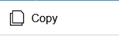

[`◀️Homepage`](../../../README.md)

# **Header Table Button** 

**import**
- *`import M_HeaderTableButton from 'src/components/M_Components/M_HeaderTableButton/M_HeaderTableButton'`*

**Basic**

>            <M_HeaderTableButton icon={"/icons/copy.svg"} label="Copy" onClick={()=> do something()} />

**Other features**

| Properties 	| Description                          	| Example                  	|
|------------	|--------------------------------------	|--------------------------	|
| onClick    	| Passed function is executed on click 	| onClick={()=>function()} 	|
| iconColor  	| Pass a Color for the Icon            	| iconColor={'pink'}       	|
| labelColor 	| Pass a Color for the Label           	| labelColor={'brown'}     	|
| label         | Label sat on the button               | string                    |
| icon          | The icon to display on the button     | icon={}                   |