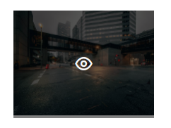
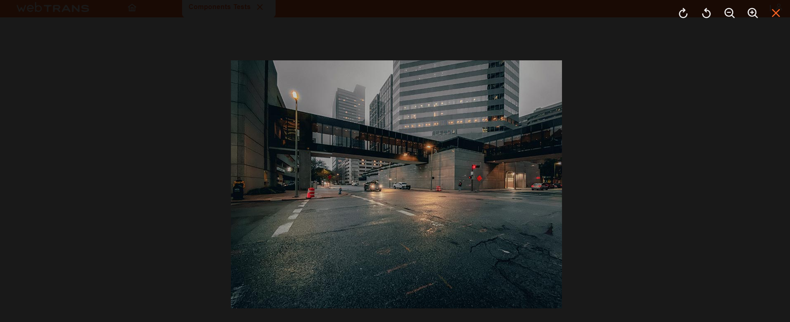

[`◀️Homepage`](../../../README.md)

# **Image Preview**

**import Image Preview**
> import M_ImagePreview from 'src/M_Components/M_ImagePreview/M_ImagePreview'

## **Basic**
To create a Preview Image, you need an image url, an "indicatorIcon", the icon used to open the image, an "alt", where you define the caption, and a "width", where you define the size of the image. This component then allows you to open the image in a more detailed view with the possibility of enlarging, shrinking and rotating the image.

    

**Image Preview**

>       <M_ImagePreview
>          url={"https://primefaces.org/cdn/primereact/images/galleria/galleria12.jpg"}
>          icon={"pi pi-user"}
>          alt={"Teste"}
>          width={199}
>       />

## **Other Features**

| Properties     | Description                                      | Example              |
| -------------- | ------------------------------------------------ | -------------------- |
| url            | Image path definition                            | url={"url"}          |
| icon           | Image icon displayed to open                     | icon={"pi pi-user"}  |
| alt            | Image Caption                                    | alt={"teste"}        |
| width          | Desired image size                               | width={199}          |
