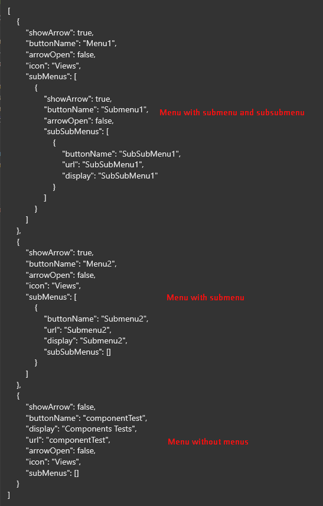

[`◀️Homepage`](../../../README.md)

# **Lateral Menu** 

**import**
- *`import M_LateralMenu from 'src/M_Components/M_LateralMenu/M_LateralMenu'`*

**Basic**

To create a basic lateral menu like this, you only need to use the showMenu, menus, setMenus and bodyPage properties.

>            <M_LateralMenu showMenu={showMenu} menus={menus} setMenus={setMenus} bodyPage={<></>}/>

**Other features**

| Properties 	| Description                          	| Example                  	|
|------------	|--------------------------------------	|--------------------------	|
| showMenu    	| It's a state of the tabsHomePage 	    | showMenu={showMenu}	    |
| menus        	| It's a state of the tabsHomePage      | menus={menus}             |
| setMenus  	| It's a state of the tabsHomePage      | setMenus{setMenus}        |
| bodyPage      | The rest of the page next to the tabs | 
 something 
     |
| primaryColor  | Pass a Color for the component        | "var(--color-orange)"     |
| iconFilter    | Pass a Filter for the Icons           | 'invert(61%) sepia(60%) saturate(5363%) hue-rotate(345deg) brightness(100%) contrast(98%)'                                  |

**Helpers**
> To generate filters you can use this link : https://codepen.io/sosuke/pen/Pjoqqp

> <b>To use the menu state:</b>  
> You need to edit the json file in the tabsHomePage folder  
  
>  
>The images are saved in `/icons/menuIcons` in format svg and you just need to insert the image name in the icon.