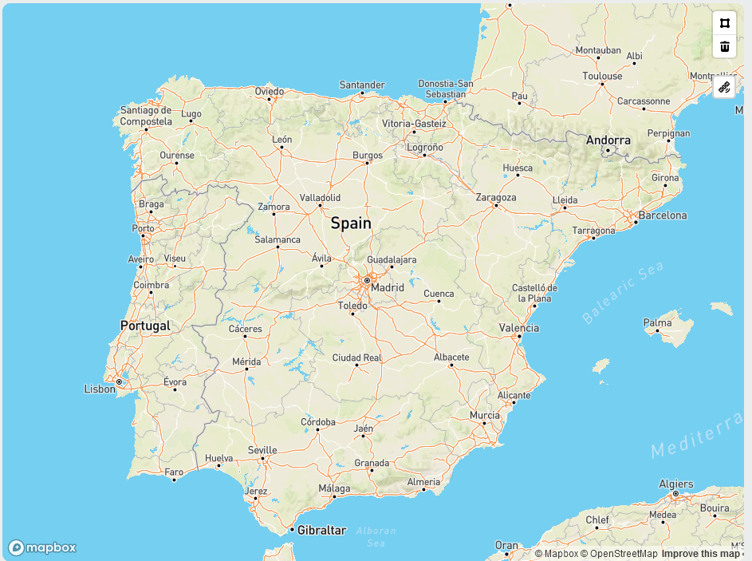

[`◀️Homepage`](../../../README.md)

# **Map** 

**import**
- *`import M_Map from 'src/components/M_Components/M_Map/M_Map'`*

**Basic**

>            <M_Map center={center} zoom={zoom} points={points} />

**Other features**
| Properties 	| Description                                                         	| Example                              	|
|------------	|---------------------------------------------------------------------	|--------------------------------------	|
| center     	| coordinates to center the map. Array with two numbers (coordinates) 	| [-8.0079, 39.5579]                   	|
| zoom       	| how much the map is zoomed, integer.                                	| 6                                    	|
| draw       	| true or false                                                       	|                                      	|
| onDrawEnd  	| return an array of the coordinates drawn. array of arrays           	| [[-8.0079, 39.5579],[8.234,-23.321]] 	|
| points     	| array of coordinates. Used to set points on the map.                	| [[-8.0079, 39.5579],[8.234,-23.321]] 	|
| polygon 	|              array of an array of coordinates. Draws a polygon                                                       	|   [[[-8.0079, 39.5579],[8.234,-23.321]],...]                                   	|
|            	|                                                                     	|                                      	|
