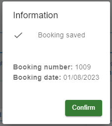

[`◀️Homepage`](../../../README.md)

# **Message Board** 

**import**
- *`import M_MessageBoard from 'src/components/M_Components/M_MessageBoard/M_MessageBoard'`*

**Basic**

>            <M_MessageBoard open={openDialog} onClose={handleCloseDialog} title={"Information"} body={body} footer={footer} />

**Other features**

| Properties   	| Description                                                              	| Example                     	|
|--------------	|--------------------------------------------------------------------------	|-----------------------------	|
| open         	| value of some useState to open this message                              	|                             	|
| onClose      	| Pass a function to active onClose                                        	| onClose={()=&gt;function()} 	|
| title        	| Label sat on top of the Message                                          	| string                      	|
| body         	| function that returns HTML code                                          	|                             	|
| footer       	| function that returns HTML code                                          	|                             	|
| minWidth     	| style. string                                                            	|                             	|
| warning      	| boolean. Shows a Warning icon                                            	|                             	|
| width        	| style. string                                                            	|                             	|
| maxWidth     	| style. string                                                            	|                             	|
| headerButton 	| HTML ELEMENT. First used for a button but you can use it with everything 	|                             	|
