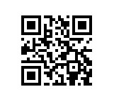
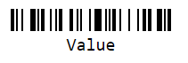

[`◀️Homepage`](../../../README.md)

# **QrCode & BarCode**

**import QRCode and BarCode**
> import M_QRCode from 'src/M_Components/M_QRCode/M_QRCode'

## **Basic**
To create a QRCode or a Bar code, you need a 'value', which is the value that will be read from the QRCode, a 'size' in the case of the QRCode and a 'barcodeHeight' in the case of the BarCode.

    

**QRCode**

>       <M_QRCode type={'qr'} value={"Value"} size={100} />

**BarCode**

>       <M_QRCode type={'bar'} value={"Value"} barcodeHeight={"25"} />

## **Other Features**

| Properties        | Description                                                                          | Example                   |
| ----------------- | ------------------------------------------------------------------------------------ | ------------------------- |
| type              | Define whether it is QR or Bar                                                       | type={"qr"}               |
| value             | Value that will be read when scanning the QRCode                                     | value={"Value"}           |
| size              | Defining the size of the QRCode                                                      | size={50}                 |
| barcodewHeight    | Defining the size of the BarCode                                                     | barcodeHeight={"25"}      |
