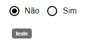

[`◀️Homepage`](../../../README.md)

# **Radio Button** 

**import**
- *`import M_RadioButton from 'src/M_Components/M_RadioButton/M_RadioButton'`*

**Basic**

To create a radio like this, you only need to use the label propriety.

>            <M_RadioButton options={radioOptions} tooltipName={"teste"} />

**Other features**

| Properties   | Description                                         | Example                          |
| ------------ | --------------------------------------------------- | -------------------------------- |
| label        | Label sat on the radiobutton                        | string                           |
| options      | Object that makes the radio buttons appear          | options={radioOptions}           |
| selectedValue| Property that selects a button by default           | selectedValue={}                 |
| labelColors  | The color of the labels                             | color={'var(--color-black)'}     |
| radioColors  | The color of the radios                             | color={'var(--color-blue)'}      |
| required     | If true, the input element is required              | required={true}                  |
| onChange     | Callback fired when the state is changed.           | onChange={(e) => e.target.value} |
| disabled     | If true, the component is disabled                  | disabled={false}                 |
| tooltipName  | Label to show tooltip                               | tooltipName={"tooltip"}          |