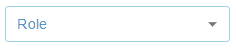
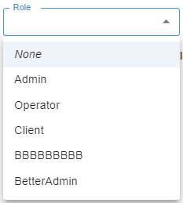

[`◀️Homepage`](../../../README.md)

# **Select** 

**import**
- *`import M_Select from 'src/components/M_Components/M_Select/M_Select'`*

**Basic**

>            <M_Select color={'var(--color-blue)'} secondColor={'var(--color-blue-light)'} label={'Role'} value={value} options={arrayObject}/>

**Other features**

| Properties    	| Description                                                                                      	| Example                                              	|
|---------------	|--------------------------------------------------------------------------------------------------	|------------------------------------------------------	|
| label         	| Label sat on top of the select                                                                   	| string                                               	|
| value         	| Value that shows on the select                                                                   	| value={value}                                        	|
| options       	| Array of objects that will build the rows in the select. (objects are made up a label and value) 	| options={[{label: "Admin", value: "value" }]}        	|
| disabled      	| If true, the component is disabled                                                               	| disabled={true}                                      	|
| required      	| If true, the input element is required                                                           	| required={true}                                      	|
| color         	| primaryColor                                                                                     	|                                                      	|
| secondColor   	| Pass a color to use this property                                                                	| secondColor={'var(--color-blue)'}                    	|
| onChange      	| if not autocomplete, function to return event with the selected value                            	|                                                      	|
| onClick       	| function. will return object of the element selected                                             	|                                                      	|
| multiple      	| boolean. Allow the selection of multiple values                                                  	|                                                      	|
| minWidth      	|                                                                                                  	|                                                      	|
| itemTemplate  	| function that has to return an HMTL ELEMENT. Replaces options.                                   	| itemTemplate={(elem) =&gt; { return ({elem.name}) }} 	|
| height        	|                                                                                                  	|                                                      	|
| margin        	|                                                                                                  	|                                                      	|
| padding       	|                                                                                                  	|                                                      	|
| fontSize      	|                                                                                                  	|                                                      	|
| marginLeft    	|                                                                                                  	|                                                      	|
| marginRight   	|                                                                                                  	|                                                      	|
| size          	| used in width. string                                                                            	|                                                      	|
| autocomplete  	| lets you type and selectes an option.                                                            	|                                                      	|
| onChangeValue 	| onChange used for the autocomplete option                                                        	|                                                      	|
| noNone        	| boolean. Removes the none option                                                                 	|                                                      	|
