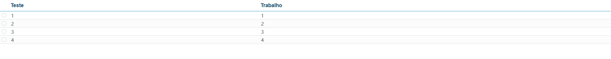

[`◀️Homepage`](../../../README.md)

# **Simple Table** 

**import**
- *`import M_SimpleTable from 'src/components/M_Components/M_SimpleTable/M_SimpleTable'`*

**Basic**

>                   <M_SimpleTable
>                       isSelectSingle
>                       rows={firstData}
>                       columns={dynamicColumns}
>                       selectedRows={selectedRows}
>                       onSelectionChange={(e) => setSelectedRows(e.value)}
>                   />

**Other features**

| Properties        	| Description                                                              	| Example                                                                                           	|
|-------------------	|--------------------------------------------------------------------------	|---------------------------------------------------------------------------------------------------	|
| rows              	| Array of Objects. Obligatory. Used in conjunction with the columns.      	| [{ id: '1', teste: '1', trabalho: '1' }, ...]                                                     	|
| columns           	| Array of Objects. Obligatory. Used to build the columns of the table.    	| [{ id: '1', header: 'teste', field: 'teste' },{ id: '2', header: 'trabalho', field: 'trabalho' }] 	|
| selectedRows      	| Array of Objects. Lines                                                  	|                                                                                                   	|
| onSelectionChange 	| if a selection mode is on,returns array of line objects                  	| onSelectionChange={(e)=>setSelectedRows(e.value)}                                                 	|
| isSelectSingle    	| defines if selection mode is single. True/False                          	| isSelectSingle                                                                                    	|
| isSelectMultiple  	| defines if selection mode is multiple. True/False                        	| isSelectMultiple                                                                                  	|
| header            	| HTMLElement                                                              	|                                                                                                   	|
| limitHeight       	| height used to limit size of table                                       	| limitHeight={'100'}                                                                               	|
| width             	| width of the table                                                       	| width={'100%'}                                                                                    	|
| color             	| change primary color                                                     	|                                                                                                   	|
| secondColor       	| change secondary color                                                   	|                                                                                                   	|
| onMouseOver       	| Event.                                                                   	|                                                                                                   	|
| tableContextMenu  	| Array of objects used to build a contextMenu. DO NOT PUT IN A USESTATE!. 	|                                                                                                   	|