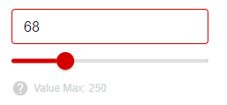

[`◀️Homepage`](../../../README.md)

# **Slider**

**import Slider**
> import { M_Slider } from 'src/M_Components'

## **Basic**
To create a slider, you need to pass a 'color', which defines the color of the slider, a 'min', which corresponds to the minimum that the slider accepts, a 'max', which corresponds to the maximum value of the slider, the 'step', which indicates how many boxes the slider will work in, and a 'labelColor', corresponding to the label displayed below the slider.

    

**Slider**

>       <M_Slider
>           color={"var(--color-red)"}
>           min={0}
>           max={250}
>           step={1}
>           labelColor={"var(--color-grey)"}
>       />

## **Other Features**

| Properties     | Description                                      | Example                           |
| -------------- | ------------------------------------------------ | --------------------------------- |
| color          | Slider color definition                          |  color={"var(--color-red)"}       |
| min            | Defining the minimum Slider value                | min={0}                           |
| max            | Setting the maximum slider value                 | max={250}                         |
| step           | Defining the steps on which the Slider will work | step={1}                          |
| labelColor     | Color of the label under the Slider              | labelColor={"var(--color-grey)"}  |