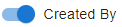

[`◀️Homepage`](../../../README.md)

# **Switch Button** 

**import**
- *`import M_SwitchButton from 'src/components/M_Components/M_SwitchButton/M_SwitchButton'`*

**Basic**

To create an interrutor like this, you just need to use the label and color properties.

>            <M_SwitchButton color={"var(--color-blue)"} label="Created By"/>

**Other features**

| Properties     	| Description                            	| Example                     	|
|----------------	|----------------------------------------	|-----------------------------	|
| label          	| string. label for the switch button    	|                             	|
| checked        	| If true, the component is checked      	| checked={false}             	|
| onClick        	| Pass a function to activate onClick    	| onClick={()=&gt;function()} 	|
| onChange       	| function that passes an event          	|                             	|
| required       	| If true, the input element is required 	| required={true}             	|
| disabled       	| If true, the component is disabled     	| disabled={false}            	|
| defaultChecked 	| The default checked state              	| defaultChecked={false}      	|
| tooltipName    	| Label to show tooltip                  	| tooltipName={"tooltip"}     	|
| color          	| string                                 	|                             	|
| labelColor     	| string                                 	|                             	|
| fontSize       	|                                        	|                             	|
|                	|                                        	|                             	|
