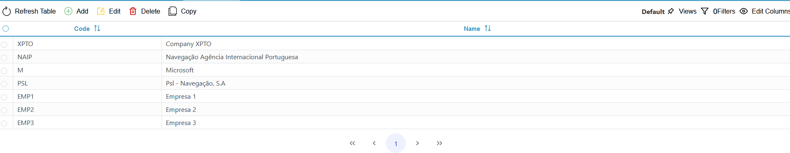

[`◀️Homepage`](../../../README.md)

# **Table** 

**import**
- *`import M_Table from 'src/components/M_Components/M_Table/M_Table'`*

**Basic**

>          <M_Table
>            entityName={'bl'}
>            onPassLine={getLineBL}
>            onPassContext={getContextBL}
>            refresh={refresh}
>            setRefresh={setRefresh}
>           />

**Other features**

| Properties         	| Description                                                                                                                                                                                                               	| Example                                                                                                      	|
|--------------------	|---------------------------------------------------------------------------------------------------------------------------------------------------------------------------------------------------------------------------	|--------------------------------------------------------------------------------------------------------------	|
| entityName         	| entity used on the table                                                                                                                                                                                                  	| 'bl','booking',...                                                                                           	|
| rolePermissions    	| array of strings with entity-operations                                                                                                                                                                                   	| 'blCreate','blEdit','blDelete',...                                                                           	|
| roleName           	| name of the used in the rolePermissions. In some cases the entityName is different from the one used on the rolePermissions strings. when set will use it instead of the entityName.                                      	|                                                                                                              	|
| lineContext        	| array of objects used to add context options  to the context menu. objects are made up of a label, an icon, and a command ( function executed when you select this option)                                                	| [{label:'Edit',icon:'pi pi-pencil', command:() => {}}]                                                       	|
| extraButtons       	| Array of objects used to add buttons to the header of the table. objects are made up of a label, an element ('default' or an html ),a source( icon), style and a command ( function executed when you select this option) 	| [{ label: 'EditBL', element: 'default', source: '/icons/tableIcons/edit.svg', style: {}, command: () => {}}] 	|
| removeContextItems 	| Used to remove the default context Menu options. Array of strings                                                                                                                                                         	| ['Create', 'Delete']                                                                                         	|
| onHideLabels       	| returns true of false when the media query gets to a certain width. You can use this on your custom buttons that use the element                                                                                          	|                                                                                                              	|
| onPassLine         	| returns an array of selected lines ( objects )                                                                                                                                                                            	|                                                                                                              	|
| onPassContext      	| returns a single selected line (object)                                                                                                                                                                                   	|                                                                                                              	|
| refresh            	| true or false. Should be a useState                                                                                                                                                                                       	|                                                                                                              	|
| setRefresh         	| used to set the refresh value                                                                                                                                                                                             	|                                                                                                              	|
| crud               	| true or false. Preset that removes create, edit and delete options. Used on the drawers components                                                                                                                        	|                                                                                                              	|
| tableHeight        	| used to define the inner Table Height.                                                                                                                                                                                    	|                                                                                                              	|
| manualId           	| You can define manually the id that the table will use to save its values on the session storage. Use with caution!                                                                                                       	|                                                                                                              	|
| selectSingle       	| true or false. Defines if u can select a single line or multiple                                                                                                                                                          	|                                                                                                              	|
| useSessionStorage  	| true or false. Defines if you want to save its values on the session storage. skips having to make calls to the backend and therefore speeds the project                                                                  	|                                                                                                              	|
| isParentTable      	| true or false. Used when there's multiple tables on the same page ( double table). Defines that when you select a line you want the child table to use that selected line                                                 	|                                                                                                              	|
| isChildTable       	| true or false. Defines this table as the child table and will receive values from the parent table.                                                                                                                       	|                                                                                                              	|
| setParentLine      	| set value of a useState. Saves the selected line on the parent table.                                                                                                                                                     	|                                                                                                              	|
| parentLine         	| value of the useState. Has the selected line from the parent table. Used on the CrudTable component.                                                                                                                      	|                                                                                                              	|
| field              	| Has the name of the field the child table is suppose to use when filtering.                                                                                                                                               	|                                                                                                              	|
| FILTER             	| string used to pre filter the table results                                                                                                                                                                               	| '(Field Name) (eq /contains) (value)'                                                                        	|