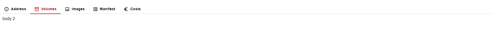
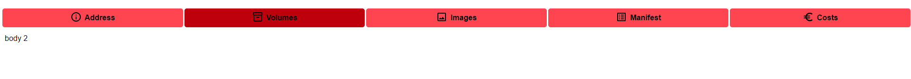

[`◀️Homepage`](../../../README.md)

# **Tabs in Page**

**import Slider**
> import { M_TabsInpage } from 'src/M_Components'

## **Introduction**
This topic explains how to implement tabs in the body of the project, in which there are two options that can be used according to what you want

**Global Structure**
>     const itemsMenuTab = [
>        { labelTab: 'Address', iconTab: <InfoOutlined />, renderBody: <Body1 /> },
>        { labelTab: 'Volumes', iconTab: <Inventory2Outlined />, renderBody: <Body2 /> },
>        { labelTab: 'Images', iconTab: <ImageOutlined /> },
>        { labelTab: 'Manifest', iconTab: <ListAltOutlined /> },
>        { labelTab: 'Costs', iconTab: <EuroOutlined /> },
>     ]

* <b> Values: </b> In the global structure above, it is made up of the 'labelTab', which indicates the name of the Tab that will be displayed, the 'iconTab' which is the icon that will complement the label, and finally the 'renderBody', where the content of each tab will be rendered.

**Format Tabs**

   * <b> Values: </b> As for the values, we need to pass the 'type', which indicates the type of tabs we want, the 'renderTabs', which imports the array mentioned above, the 'labelColor', which refers to the color of the labels on the tabs, the 'lineBottomTabs', which passes the color of the bottom line of the tabs, the 'selectedColor', which passes the color that indicates that the tab has been selected, and finally 'firstTabOpen', which indicates which tab we want to be the first to open.
  
  **Implement**

>       <M_TabsInpage
>           type={"tabs"}
>           renderTabs={itemsMenuTab}
>           labelColor={'#000000'}
>           lineBottomTabs={"#EBEDED"}
>           selectedColor={"#BD000B"}
>           firstTabOpen={2}
>       />

**Format Buttons**

   * <b> Values: </b> As for the values, we need to pass the 'type', which indicates the type of tabs we want, the 'renderTabs', where the array mentioned above is imported, the 'labelColor', which refers to the color of the labels on the tabs, the 'selectedColor', where we pass the color that indicates that the tab has been selected, then 'firstTabOpen', where we indicate which tab we want to be the first to open, and finally 'hoverSelectedColor', where we define the color when the tab is not selected, in order to distinguish it from the tab that is selected.

>       <M_TabsInpage
>           type={"buttons"}
>           renderTabs={itemsMenuTab}
>           labelColor={'var(--color-black)'}
>           selectedColor={"var(--color-red-dark)"}
>           firstTabOpen={2}
>           hoverSelectedColor={"var(--color-red-light)"}
>       />

## **Other Features**

| Properties       | Description                                                            | Example                                       |
| ---------------- | ---------------------------------------------------------------------- | --------------------------------------------- |
| type             | Define the desired type, in Tabs or Buttons format                     | type={"buttons"}                              |
| renderTabs       | Import the structure as mentioned above                                | renderTabs={itemsMenuTab}                     |
| labelColor       | Tab text color                                                         | labelColor={'var(--color-black)'}             |
| lineBottomTabs   | With bottom line, only available when type is 'tab'                    | lineBottomTabs={"#EBEDED"}                    |
| selectedColor    | Color when tab is selected                                             | selectedColor={"var(--color-red-dark)"}       |
| firstTabOpen     | first tab we want open by default                                      | firstTabOpen={2}                              |
| hoverEffectColor | hover color on buttons, only available when they are of type 'buttons' | hoverSelectedColor={"var(--color-red-light)"} |
| onGetTab         | returns label when tab is clicked                                      | onGetTab={() => }                             |