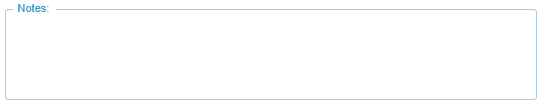

[`◀️Homepage`](../../../README.md)

# **TextArea** 

**import**
- *`import M_TextArea from 'src/components/M_Components/M_TextArea/M_TextArea`*

**Basic**

To create a Text Area field like this, you only need to use the label, rows and color properties.

>            <M_TextArea label={"Notes"} color={'var(--color-blue)'} rows={3} />

**Other features**

| Properties  	| Description                                                          	| Example                             	|
|-------------	|----------------------------------------------------------------------	|-------------------------------------	|
| value       	| Pass a value or ""                                                   	| value={value}                       	|
| onChange    	| Callback fired when the value is changed.                            	| onChange={(e) =&gt; e.target.value} 	|
| required    	| True or False                                                        	| required={true}                     	|
| disabled    	| If true, the component is disabled                                   	| disabled={false}                    	|
| helperText  	| The helper text content. This text is displayed below the text area. 	| helperText={"some text"}            	|
| color       	| string.                                                              	|                                     	|
| secondColor 	| Pass a color to use this property                                    	| secondColor={'var(--color-blue)'}   	|
| label       	| string, label of the input                                           	|                                     	|
| rows        	| size by rows. number. Default is 3                                   	|                                     	|
| helperText  	| string                                                               	|                                     	|
