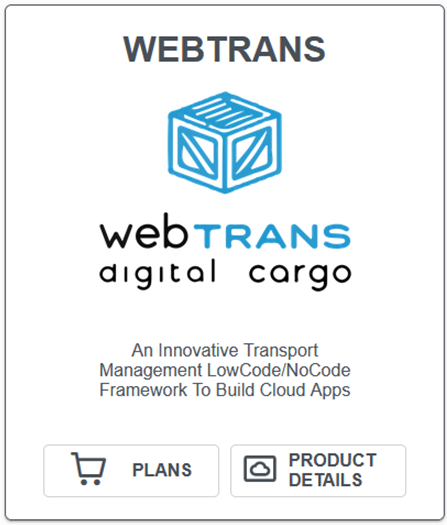
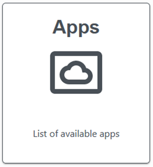

[`◀️Homepage`](../../../README.md)

# **Tile Template** 

**import**
- *`import M_TileTemplate from 'src/components/M_Components/M_TileTemplate/M_TileTemplate'`*

**Basic**

>           <M_TileTemplate
>                name={'Test'}
>                logo={'😎'}
>                description={'this is a test'}
>                action={() => console.log('test')}
>                isButton={true}
>               />

**Other features**

| Properties  	| Description                                                                                                                                               	| Example                                                           	|
|-------------	|-----------------------------------------------------------------------------------------------------------------------------------------------------------	|-------------------------------------------------------------------	|
| name        	| header title in h1. string                                                                                                                                	|                                                                   	|
| subtitle    	| header subtitle in h5. string                                                                                                                             	|                                                                   	|
| logo        	| header logo                                                                                                                                               	|                                                                   	|
| description 	| can be a string or an array of strings. How you send it defines how it shows in the card                                                                  	|                                                                   	|
| buttons     	| Array of objects. When isButton is false, uses them.  Object made up of "name"(label for the button),"logo" ( icon for the button) and a "click" function 	| [{name:"button", logo:'/icons/tableIcons/edit.svg',click=()=>{}}] 	|
| isButton    	| true or false. When true, the tile is a button.                                                                                                           	|                                                                   	|
| action      	| When isButton is true, defines the action when the tile is clicked. function                                                                              	|                                                                   	|
| width       	| used to manually set a size to the tile. default is 250.                                                                                                  	| width={400}                                                       	|