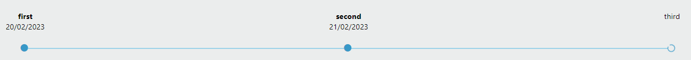

[`◀️Homepage`](../../../README.md)

# **Timeline** 

**import**
- *`import M_TimeLine from 'src/components/M_Components/M_TimeLine/M_TimeLine'`*

**Basic**

To create a time line like this, you only need to use the valueTimeLine and color properties.

>            <M_TimeLine valueTimeline={valueTimeline} color={'var(--color-blue)'} />
