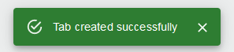

[`◀️Homepage`](../../../README.md)

# **Toast Messages** 

**Import**
- *`import LoadingContext from '../../components/utils/loading.context'`*
- *`import { useContext } from 'react'`*

**Basic**

>       const ctx = useContext(LoadingContext)
> 
>       ctx.toastMessages(type, alert, string)

The toast component is a special one as it's used throughout the hole project globaly. As such, we have contextualized it so instead of importing its component, you just import the LoadingContext component.

**Other features**

| Properties 	| Description                    	| Example          	|
|------------	|--------------------------------	|------------------	|
| type       	| Defines the color of the toast 	| Success or Error 	|
| alert      	| string in bold                 	| string           	|
| string     	| string                         	| string           	|