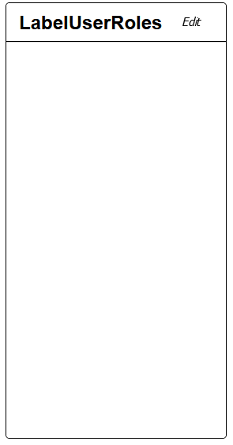

[`◀️Homepage`](../../../README.md)

# **Transferlist** 

**import**
- *`import M_TransferList from 'src/M_Components/M_TransferList/M_TransferList'`*

**Basic**

To create a basic transfer list like this, you need to use the properties below.

>             <M_TransferList header={"LabelUserRoles"} entity={'role'} field={'Name'}valueIdField={'Id'}  value={value} setValue={setValue} />

**Other features**

| Properties     	| Description                                  	| Example                              	|
|----------------	|----------------------------------------------	|--------------------------------------	|
| primaryColor   	| Style. Primary color of the component        	| primaryColor={"var(--color-orange)"} 	|
| secondaryColor 	| Style. Secondary color of the component      	|                                      	|
| header         	| Label of the List                            	| header={"Teste "}                    	|
| value          	| Array of Object. List of lines selected      	| value={value}                        	|
| setValue       	| set of the value                             	| setValue={setValue}                  	|
| entity         	| entity of the table opened in the drawer     	| entity={'Country'}                   	|
| field          	| field used for the string showed in the List 	|                                      	|
| disabled       	| boolean                                      	| disabled={true}                      	|

