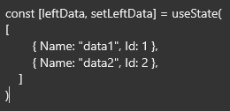

[`◀️Homepage`](../../../README.md)

# **Transferlist** 

**import**
- *`import M_TransferList from 'src/M_Components/M_TransferList/M_TransferList'`*

**Basic**

To create a basic transfer list like this, you need to use the properties below.

>            <M_TransferList primaryColor={"var(--color-orange)"} firstName={"Teste Left"} firstData={leftData} setFirstData={setLeftData} secondName={"Teste Right"} secondData={rightData} setSecondData={setRightData}/>

**Other features**

| Properties 	| Description                          	| Example                  	|
|------------	|--------------------------------------	|--------------------------	|
| primaryColor  | Primary color of the component	    | primaryColor={"var(--color-orange)"}	    |
| firstName     | Label of the first table      | firstName={"Teste Left"}             |
| firstData  	| It's a state of the first table      | firstData={leftData}        |
| setFirstData  | It's a set of the first table | setFirstData={setLeftData}    |
| secondName    | Label of the second table         | secondName={"Teste Right"}     |
| secondData    | It's a state of the second table        | secondData={rightData}     |
| setSecondData | It's a set of the second table       | setSecondData={setRightData}     |
| tooltipAdd    | Pass a name for the button        | tooltipAdd={"Add"}     |
| tooltipRemove | Pass a name for the button        | tooltipRemove={"Remove"}     |

**Helpers**

> <b>To use the menu state:</b>  
> 